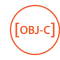
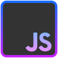

<picture>
  <source media="(prefers-color-scheme: dark)" srcset="https://raw.githubusercontent.com/thenick775/thenick775/output/github-contribution-grid-snake-dark.svg" />
  <source media="(prefers-color-scheme: light)" srcset="https://raw.githubusercontent.com/thenick775/thenick775/output/github-contribution-grid-snake.svg" />
  
</picture>

<h2 align="left">About me </h2>

I'm forever a student of Computer Science, currently learning and forever growing! 🎓

- 🔭 I’m currently working on honing my craft, and creating software that I enjoy.
- 🌱 In my own time I dabble in emulator development, iOS development, data visualization, and kernel programming.
- 🤔 I’m always looking to expand my knowledge, where I have been focusing on Golang and Java/Scala recently.
- ⚡ Fun fact: I'm a musician, and a thorough lover of anything Sci-Fi!
- 💬 Ask me about anything and everything!
- 🌐 [My Website](https://nicholas-vancise.dev)
- 📝 [My Resume](https://thenick775.github.io/resume_latex/resume.pdf)

<h2>💻 Some Personal Stats 💻</h2>
</img>

<h2>Technologies Utilized</h2>
<ul style="list-style: none; padding: 0; margin: 0;">
  
  
  
  
  
  
  
  
  
  
  
  
  
  
  
  
  
  
</ul>
